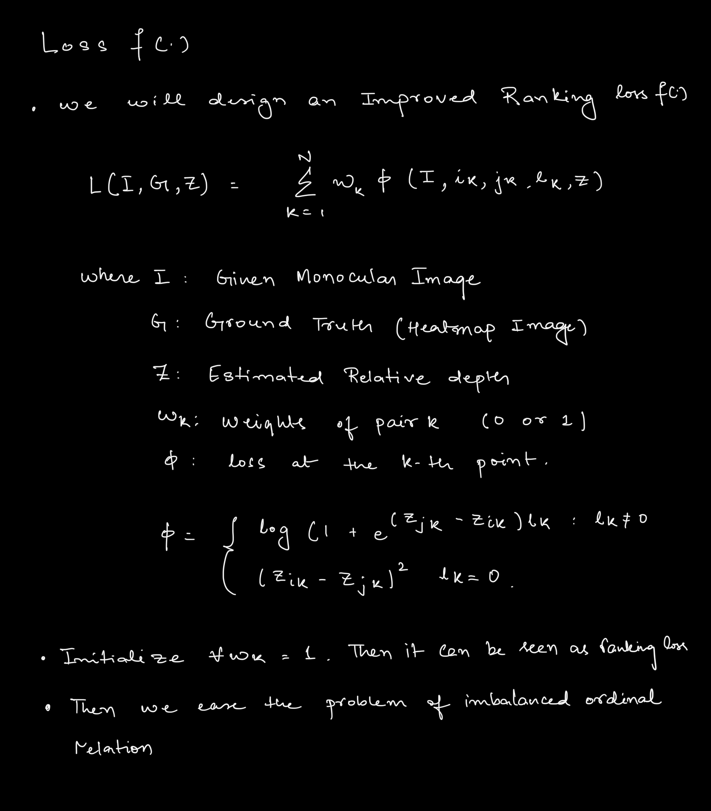

## Our custom loss

* We initial all ωk as 1 then the loss can be seen as a ranking loss.

* To avoid the difference of two unequal depth values being too large and ease the problem of imbalanced ordinal relations,
    * we first sort the loss of unequal pairs at each iteration,
    * and then ignore the smallest part by setting corresponding ωk to 0.

* More specifically, we empirically set the smallest 25% of ωk to 0.
* Therefore, the ratio of equal relation would be increased so that the problem of imbalanced ordinal relations can be alleviated.
* In addition, the ConvNet is thus enforced to focus on a set of hard pairs during training.

### Structural Similarity Index Loss (SSL)
* openly available from scikit image module
* also a pytorch implementation is here : https://github.com/Po-Hsun-Su/pytorch-ssim
* calculates a metric that involves similarity between 2 images:
    * envelops luminance , contrast and structure
* expect predicted depth map to geometrically close to the ground truth depth map
``py
from skimage.metrics import structural_similarity as ssim
``
### Depth Smoothness Loss (DSL)
* use cases where smoothness is valued more than accuracy of depth.
* for an example : a 2d to 3d modeller where feathering should not be an issue

### Hessian EigenMap Loss (HEL)
* Hessian Eigenmap . I was already working with hessian eigenmap in my local neighbourhood estimation problem in my research project
* the general idea is the hessian gives information of the local minima and the maximas of an arbitary higher dimension plane
* so we can expect to capture local structures in its depth map

